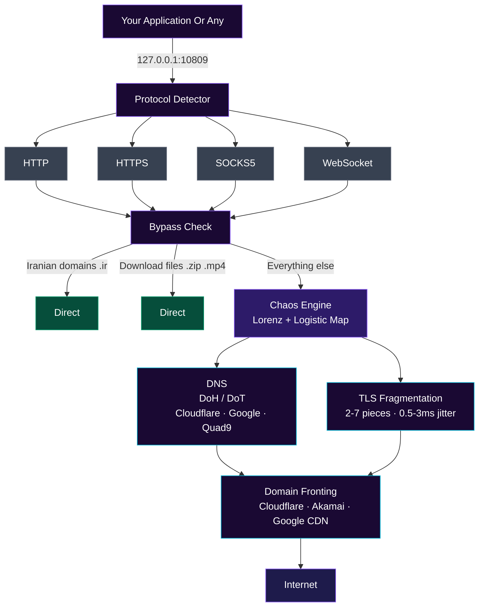
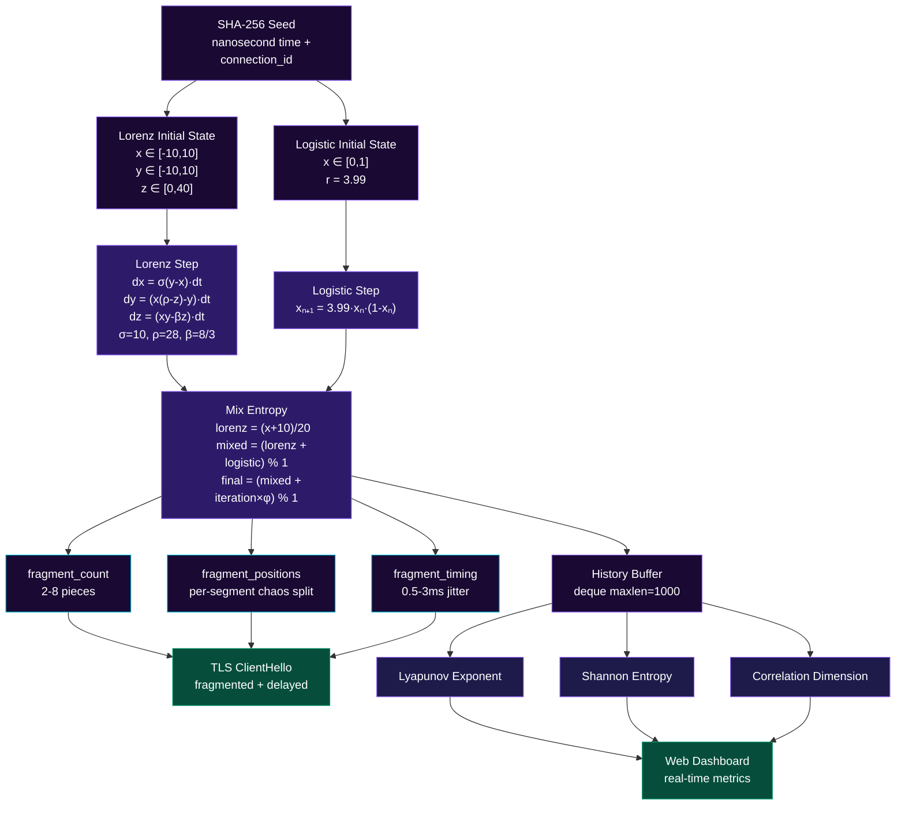

<div align="center">


---

[](https://python.org)
[](LICENSE)
[]()
[]()

</div>

---

## what is this?

a proxy engine that uses **chaos theory** to make your traffic unpredictable. instead of regular patterns that DPI can detect, it generates fragmentation timing based on the Lorenz Attractor - making each connection mathematically unique

built for bypassing censorship. tested against advanced DPI systems on Android (Termux) and Linux

---

## how it works



---

## features

| Feature | Description | Status |
|---------|-------------|--------|
| Protocol Multiplexing | Auto-detect HTTP/HTTPS, SOCKS5, WebSocket | Active |
| Chaos Fragmentation | Lorenz-Logistic hybrid TLS fragmentation | Active |
| Encrypted DNS | DoH and DoT support | Active |
| Domain Fronting | Hide destination via CDN | Active |
| Smart Bypass | Direct routing for Iranian domains | Active |
| Real-time Stats | Monitor connections and traffic | Active |
| Connection Limiting | Max 100 concurrent connections | Active |
| Web Dashboard | Visual monitoring interface | Active |
| Executable (exe) | Single-file build for Windows/Linux | Planned |

---

## install

```bash
# requirements
pip install pyyaml aiohttp numpy

# or
pip install -r requirements.txt

# termux (android)
pkg install python-numpy
pip install pyyaml aiohttp

# run
python3 main.py
```

that's it

---

## configuration

edit `config.yaml`:

```yaml
server:
  host: "0.0.0.0"        # آدرس listen - 0.0.0.0 یعنی همه interface ها
  port: 10809             # پورت پروکسی
  protocol_timeout: 30   # ثانیه - timeout برای detect کردن protocol اول

web:
  enabled: true          # داشبورد وب روشن/خاموش
  port: 8080             # پورت داشبورد

buffers:
  small: 8192            # 8KB - برای خوندن اول connection
  medium: 65536          # 64KB - buffer معمولی relay
  large: 262144          # 256KB
  xlarge: 1048576        # 1MB - برای فایل‌های بزرگ

dns:
  mode: "doh"            # doh = DNS-over-HTTPS / dot = DNS-over-TLS
  cache_ttl: 300         # ثانیه - چقدر DNS cache نگه داشته بشه
  cache_max_size: 1000   # حداکثر تعداد entry در cache

limits:
  max_connections: 100   # حداکثر connection همزمان
  connection_timeout: 30 # ثانیه - timeout کل connection
  idle_timeout: 60       # ثانیه - قطع connection بی‌تحرک

bypass:
  iranian_domains: true          # دامنه‌های .ir مستقیم وصل بشن
  download_direct: true          # فایل‌های دانلودی (.zip .mp4 ...) مستقیم

chaos:
  aggressive: true        # true = fragmentation بیشتر، سخت‌تر برای DPI
  base_jitter_ms: 1.0    # میلی‌ثانیه - تاخیر پایه بین fragment ها
  variance_ms: 2.0       # میلی‌ثانیه - میزان تصادفی بودن تاخیر

evasion:
  domain_fronting: true   # مخفی کردن مقصد از طریق CDN
  tls_fragmentation: true # شکستن TLS ClientHello به چند تکه
  traffic_padding: true   # اضافه کردن padding به packet ها (planned)
  dummy_traffic: true     # ترافیک فیک برای گمراه کردن DPI (planned)
  protocol_mimicry: true  # شبیه‌سازی protocol های دیگه (planned)

performance:
  connection_pooling: true  # reuse کردن connection ها (planned)
  pool_max_size: 50         # حداکثر connection در pool
  smart_caching: true       # cache هوشمند response ها (planned)

logging:
  level: "INFO"  # DEBUG / INFO / WARNING / ERROR
  file: "cte.log"  # فایل لاگ - حذف کن اگه نمیخوای
  console: true    # نمایش لاگ در terminal
```

---

## usage

**start the server:**
```bash
python3 main.py
```

**configure your client :**

```
# HTTP
Proxy: 127.0.0.1:10809  |  Type: HTTP

# SOCKS5
Host: 127.0.0.1  |  Port: 10809  |  Type: SOCKS5
```

---

## web dashboard

open `http://127.0.0.1:8080` in your browser while the proxy is running.

shows live stats — connections, traffic, routing, protocols, chaos metrics, DNS cache.  
auto-refreshes every 2 seconds.

---

## chaos engine



---

## dns privacy

```
DoH (DNS-over-HTTPS)  →  Cloudflare / Google / Quad9 / AdGuard
DoT (DNS-over-TLS)    →  same providers
```

prevents DNS poisoning. hides queries from ISP

---

## performance

```
Max Connections  →  100 concurrent
Throughput       →  ~50-100 Mbps
Added Latency    →  +2-5ms (fragmentation overhead)
Memory Usage     →  ~50-100 MB
```

> numbers based on `aggressive: true` — latency drops to ~1ms with `aggressive: false`

---

## project structure

```
chaos_traffic_engine/
│
├── main.py
├── config.yaml
├── requirements.txt
│
├── core/
│   ├── engine.py
│   ├── dns.py
│   └── tls.py
│
├── server/
│   ├── proxy.py
│   ├── protocols.py
│   └── relay.py
│
├── evasion/
│   └── fronting.py
│
├── monitoring/
│   ├── stats.py
│   └── limiter.py
│
├── utils/
│   ├── bypass.py
│   └── logger.py
│
├── web/
│   ├── dashboard.py
│   ├── api.py
│   └── static/
│       ├── index.html
│       ├── script.js
│       └── style.css
│
└── config/
    ├── dns_servers.json
    ├── cdn_domains.json
    └── iranian_domains.json
```

---

## troubleshooting

**port already in use:**
```bash
sudo lsof -i :10809
# change port in config.yaml if needed
```

**DNS failing:**
```yaml
dns:
  mode: "dot"  # switch between doh/dot
```

**slow speed:**
```yaml
chaos:
  aggressive: false  # reduce fragmentation overhead
```

**YouTube buffering:**
```yaml
evasion:
  domain_fronting: false  # disable if streams keep dropping
```

---

## security notes

- ✅ encrypted DNS — queries hidden from ISP
- ✅ unpredictable TLS fingerprint — chaos-generated, unique per connection
- ✅ domain fronting — real destination hidden behind CDN
- ✅ Iranian domain bypass — local traffic never goes through proxy
- ⚠️ no authentication — bind to `127.0.0.1` if on a shared network

---

<div align="center">

**MIT License** — use freely, ethically, responsibly.

*✧ 𝙎𝙩𝙖𝙮 𝙐𝙣𝙠𝙣𝙤𝙬𝙣, 𝙨𝙩𝙖𝙮 𝙛𝙧𝙚𝙚 ✧* 

</div>