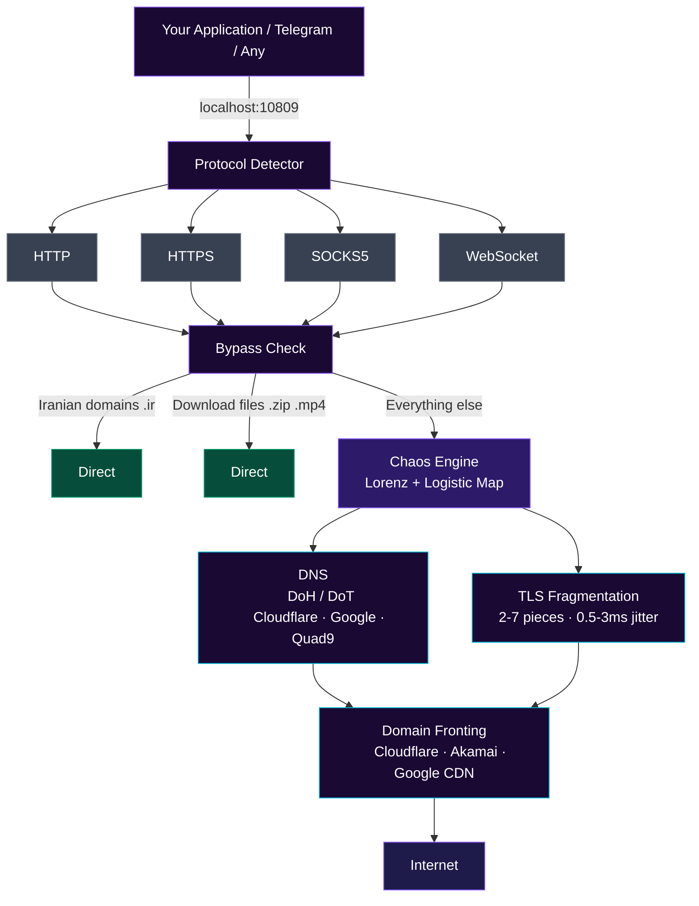

<div align="center">


---

[](https://python.org)
[](LICENSE)
[]()
[]()

</div>

---

## what is this?

a proxy engine that uses **chaos theory** to make your traffic unpredictable. instead of regular patterns that DPI can detect, it generates fragmentation timing based on the Lorenz Attractor - making each connection mathematically unique.

built for bypassing censorship. tested against advanced DPI systems.

---

## how it works


```mermaid
flowchart TD
    A["Your Application / Telegram / Any"]

    A -->|localhost:10809| B["Protocol Detector"]

    B --> C[HTTP]
    B --> D[HTTPS]
    B --> E[SOCKS5]
    B --> F[WebSocket]

    C & D & E & F --> G["Bypass Check"]

    G -->|Iranian domains .ir| H["Direct"]
    G -->|Download files .zip .mp4| I["Direct"]
    G -->|Everything else| J["Chaos Engine
    Lorenz + Logistic Map"]

    J --> K["DNS
    DoH / DoT
    Cloudflare · Google · Quad9"]

    J --> L["TLS Fragmentation
    2-7 pieces · 0.5-3ms jitter"]

    K & L --> M["Domain Fronting
    Cloudflare · Akamai · Google CDN"]

    M --> N["Internet"]

    style A fill:#1a0933,stroke:#8B5CF6,color:#fff
    style B fill:#1a0933,stroke:#8B5CF6,color:#fff
    style G fill:#1a0933,stroke:#8B5CF6,color:#fff
    style J fill:#2d1b69,stroke:#8B5CF6,color:#fff
    style K fill:#1a0933,stroke:#06B6D4,color:#fff
    style L fill:#1a0933,stroke:#06B6D4,color:#fff
    style M fill:#1a0933,stroke:#06B6D4,color:#fff
    style H fill:#064e3b,stroke:#059669,color:#fff
    style I fill:#064e3b,stroke:#059669,color:#fff
    style N fill:#1e1b4b,stroke:#8B5CF6,color:#fff
    style C fill:#374151,stroke:#6B7280,color:#fff
    style D fill:#374151,stroke:#6B7280,color:#fff
    style E fill:#374151,stroke:#6B7280,color:#fff
    style F fill:#374151,stroke:#6B7280,color:#fff
```

---

## features

| Feature | Description | Status |
|---------|-------------|--------|
| Protocol Multiplexing | Auto-detect HTTP/HTTPS, SOCKS5, WebSocket | Active |
| Chaos Fragmentation | Lorenz-Logistic hybrid TLS fragmentation | Active |
| Encrypted DNS | DoH and DoT support | Active |
| Domain Fronting | Hide destination via CDN | Active |
| Smart Bypass | Direct routing for Iranian domains | Active |
| Real-time Stats | Monitor connections and traffic | Active |
| Connection Limiting | Max 100 concurrent connections | Active |
| Docker Support | Containerized deployment | Planned |
| GUI Dashboard | Visual monitoring interface | Planned |
| Authentication | Access control | Planned |

---

## install

```bash
# requirements
pip install pyyaml

# run
python3 main.py
```

that's it.

---

## configuration

edit `config.yaml`:

```yaml
server:
  host: "0.0.0.0"
  port: 10809

dns:
  mode: "doh"       # or "dot"

limits:
  max_connections: 100

bypass:
  iranian_domains: true
  download_direct: true

chaos:
  aggressive: true  # more fragmentation = harder to detect

evasion:
  domain_fronting: true
  tls_fragmentation: true
```

---

## usage

**start the server:**
```bash
python3 main.py
```

**configure your client:**

```
# Proxy (HTTP)
Proxy: localhost:10809  |  Type: HTTP

# SOCKS5
Host: localhost  |  Port: 10809  |  Type: SOCKS5

# Telegram
Connection: SOCKS5  |  Server: localhost  |  Port: 10809

But not working
```

---

## chaos engine

the core of this project. uses a **Lorenz Attractor + Logistic Map hybrid** to generate timing patterns:

```python
# each connection gets unique fragmentation
fragment_count  = lorenz_x → maps to 2-7 pieces
fragment_timing = logistic_map → 0.5-3ms jitter
fragment_pos    = lorenz_z → unpredictable splits
```

since the attractor never repeats, no two connections look alike.  
DPI systems that learn "normal" patterns can't adapt.

---

## dns privacy

```
DoH (DNS-over-HTTPS)  →  Cloudflare / Google / Quad9 / AdGuard
DoT (DNS-over-TLS)    →  same providers
```

prevents DNS poisoning. hides queries from ISP.

---

## performance

```
Max Connections  →  100 concurrent
Throughput       →  ~50-100 Mbps
Added Latency    →  +2-5ms (fragmentation overhead)
Memory Usage     →  ~50-100 MB
```

---

## project structure

```
chaos-traffic-engine/
│
├── main.py                   # entry point
├── config.yaml               # configuration
│
├── core/
│   ├── engine.py             # chaos engine (Lorenz + Logistic)
│   ├── dns.py                # DNS resolver (DoH + DoT)
│   └── tls.py                # TLS parser & fragmenter
│
├── server/
│   ├── proxy.py              # main proxy server
│   ├── protocols.py          # protocol handlers
│   └── relay.py              # traffic relay
│
├── evasion/
│   └── fronting.py           # domain fronting
│
├── utils/
│   ├── bypass.py             # bypass manager
│   ├── stats.py              # statistics
│   ├── limiter.py            # connection limiter
│   └── logger.py             # logging
│
└── config/
    ├── dns_servers.json      # DNS providers
    ├── cdn_domains.json      # CDN domains
    └── iranian_domains.json  # bypass list
```

---

## troubleshooting

**port already in use:**
```bash
sudo lsof -i :10809
# change port in config.yaml if needed
```

**DNS failing:**
```yaml
dns:
  mode: "dot"  # switch between doh/dot
```

**slow speed:**
```yaml
chaos:
  aggressive: false  # reduce fragmentation overhead
```

---

## security notes

- ✅ encrypted DNS (no ISP snooping)
- ✅ unpredictable TLS patterns
- ✅ domain fronting support
- ⚠️ no built-in authentication — add firewall rules if exposing to network

---

<div align="center">

**MIT License** — use freely, ethically, responsibly.

*✧ 𝙎𝙩𝙖𝙮 𝙐𝙣𝙠𝙣𝙤𝙬𝙣, 𝙨𝙩𝙖𝙮 𝙛𝙧𝙚𝙚 ✧* 

</div>
